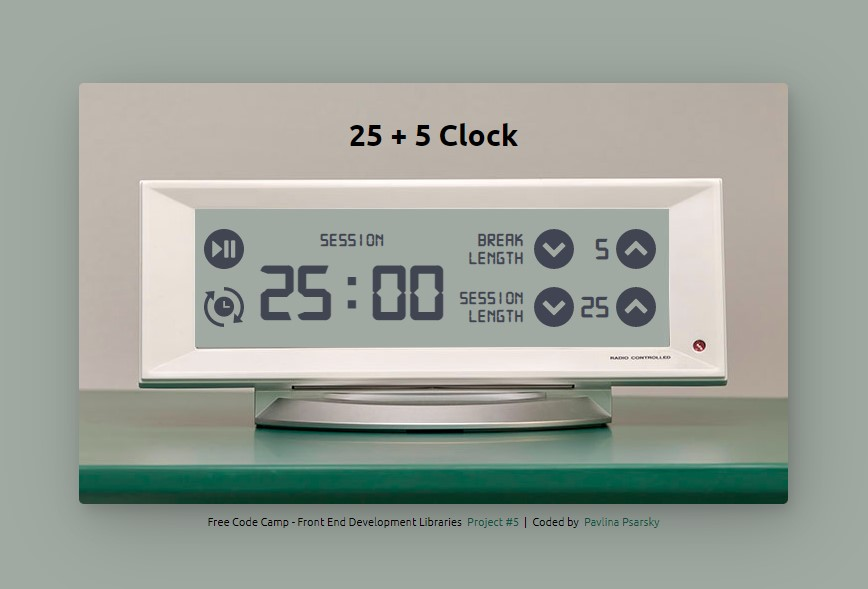

## freeCodeCamp - Front End Development Libraries Project

# Build a 25 + 5 Clock

This is my solution to the [Build a 25 + 5 Clock](https://www.freecodecamp.org/learn/front-end-development-libraries/front-end-development-libraries-projects/build-a-25--5-clock), the final of 5 projects to earn the Front End Development Libraries certification. FreeCodeCamp's mission is to help people learn to code for free.

## Table of contents

- [Overview](#overview)
  - [The challenge](#the-challenge)
  - [Screenshot](#screenshot)
  - [Links](#links)
- [My process](#my-process)
  - [Built with](#built-with)
  - [What I learned](#what-i-learned)
  - [Continued development](#continued-development)
  - [Useful resources](#useful-resources)
- [Author](#author)
- [Acknowledgments](#acknowledgments)

## Overview

### The challenge

Fulfill the user stories and get all of the tests to pass. You can use any mix of HTML, JavaScript, CSS, Bootstrap, SASS, React, Redux, and jQuery to complete this project.

### Screenshot

### Links

- Solution URL: https://github.com/PavlinaPs/25-5-clock-react
- Live Site URL: https://pavlinaps.github.io/25+5-clock-react

## My process

I used Vite and the useRef hook for the first time.

I have already used useReducer hook in previous project, implementing it went quite well.

All of the trouble concentrated in the \<audio> element and also working with \<svg>s.

### Built with

- React.js

### What I learned

I learned really a lot and also realized that I can rely on my previous JavaScript knowledge. The order of learning seems to be correct.

useReducer hook first looked complicated, but in fact it is not and I can see its advantages in maintaining the state.

I had a lot of trouble with the \<audio> element, again. First hooking it up and second passing the last audio test. I would rather use Audio() constructor. But I made it work.

I learned how to work with \<svg>s in React.js, without any additional library, as a component. I found a great article on this topic at Free Code Camp, I saved it below with other useful links.

A also learned a little more about fonts, after I had realized that I need a monospace font, in order the timer doesn't jump sideways when digit 1 is displayed. I didn't like any such font on Google fonts, so I downloaded one and made @font-face rule in css.

### Continued development

I still have a long road ahead of me, learn more hooks, custom hooks, CRUD, APIs, etc.

### Useful resources

- [STOP Wasting Time! Your Next App Needs Vite! | JS, Typescript, React](https://www.youtube.com/watch?v=SsITROMWhnM) - Dave Gray's another great YouTube video
- [Refs and the DOM](https://reactjs.org/docs/refs-and-the-dom.html) - React documentation
- [useRef](https://beta.reactjs.org/reference/react/useRef) - React documentation
- [Manipulating the DOM with Refs](https://beta.reactjs.org/learn/manipulating-the-dom-with-refs) - React documentation
- [setInterval()](https://developer.mozilla.org/en-US/docs/Web/API/setInterval) - on MDN
- [How to Use SVG Icons in React with React Icons and Font Awesome](https://www.freecodecamp.org/news/how-to-use-svg-icons-in-react-with-react-icons-and-font-awesome/) - Great article on Free Code Camp
- [SVG viewBox Attribute](https://www.geeksforgeeks.org/svg-viewbox-attribute/) - on Geeks for Geeks

## Author

- Website - [My portfolio](https://pavlinaps.github.io/my-portfolio/)
- freeCodeCamp - [@pavlina1](https://www.freecodecamp.org/pavlina1)
- Frontend Mentor - [@PavlinaPs](https://www.frontendmentor.io/profile/PavlinaPs)
- Codewars - [PavlinaPs](https://www.codewars.com/users/PavlinaPs)
- Twitter - [@PPsarsky](https://www.twitter.com/PPsarsky)

## Acknowledgments

It is great that I can learn to code with freeCodeCamp. I really appreciate what they are doing for the coding community. The projects are all very useful for me. All of them. Thank you!
